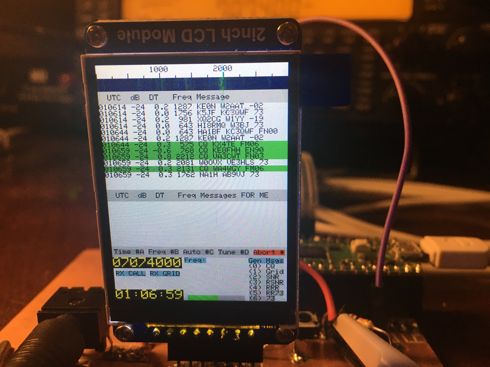

# Raspberry Pi Pico FT8 Transciever

Run FT8 on the $4 Raspberry Pi Pico microcontroller! This code, based on
[Karlis Goba's (YL3JG) FT8 Library](https://github.com/kgoba/ft8_lib), runs a
standalone FT8 amateur radio transciever.

### It does the following:

- Decodes FT8 signals in real-time.
- Displays decoded signals and a spectrum waterfall on a ST7789 240x320 LCD display.
- Controls a Si5351 programmable oscillator used for a direct conversion
  reciever, and for driving a Class-E amplifier during transmission.
- Encodes response messages based on recieved messages and user selection.
- Reads in user selection from a 4x4 membrane keyboard.
- Offers a startup screen where time is calibrated to the second to ensure
  proper reception/transmission intervals.

### Technical Notes

- This code implements incremental decoding. The Pico only has around 200kB of
  RAM. It is not possible to store a 15 second duration of samples, and thus
  samples are collected in ~1 second intervals, processed with the FFT, and only
  the FFT data is stored.
- The Pico has a dual-core processor. This code uses multithreading, using one
  core to control the functionality of the transciever (display, ADC readings,
  etc.) and the other core to do signal processing (FFT and error correction
  codes).
- This code overclocks the Pico's processor, since running at normal clock
  frequency, it is unable to keep up with decoding all samples within the 15
  second transmission interval.
- The audio-frequency FT8 signals are fed into the built-in ADC on the Pico. The
  Pico has the ability to sample two analog inputs, but only one is used right
  now. In the future both can be used for quadrature signals coming out of a
  direct conversion reciever so the transciever can have sideband rejection. 

### Development

- Set up the Raspberry Pi Pico C/C++ SDK, as described
[here](https://www.raspberrypi.com/documentation/pico-sdk/).
- My apologies for the sloppy code quality. I coded this in high school, before
  I took a proper programming class. I've improved since then.
- See [Dhiru Kholia's (VU3CER) fork of my
  code](https://github.com/kholia/pico_ft8_xcvr) for his own transciever
  project. His project has details on how to implement it in hardware.

